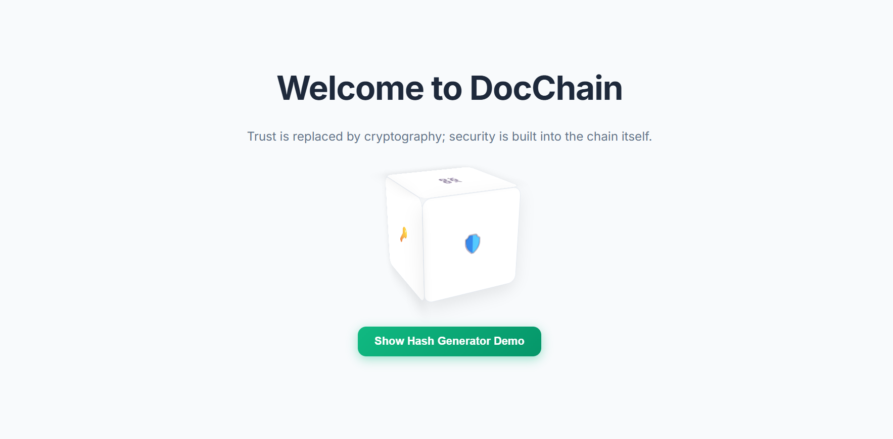
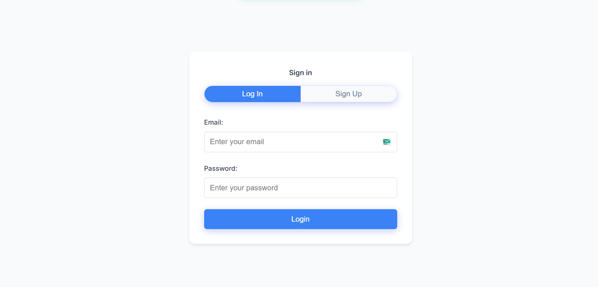
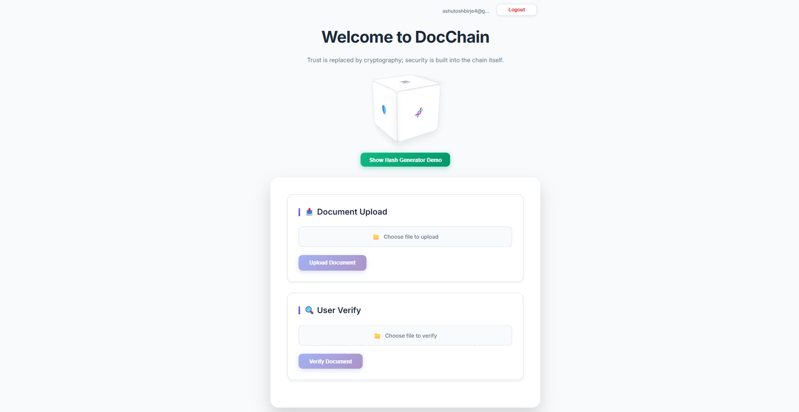
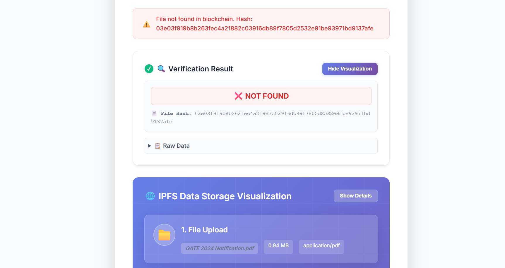

# 🔗 DocChain: Unified Document Verification Platform 🔗

## 📚 Project Domain
**Domain**: Web application development with blockchain
**Tech Stack**: MERN (MongoDB, Express.js, React.js, Node.js), BlockChain

## 🧩 Problem Statement

## 💡 Project Idea 

## 🔗 Blockchain Document Verification System

DocChain is a secure, blockchain-based document verification system that ensures document authenticity and integrity using cryptographic hashing and IPFS storage.

## ✨ Features

### 🔐 Authentication System
- **JWT-based Authentication**: Secure token-based user authentication
- **Role-based Access Control**: Admin and user roles with different permissions
- **Login/Register Toggle**: Seamless user registration and login experience
- **Persistent Sessions**: Authentication state persists across browser sessions

### 📄 Document Management
- **Admin Upload**: Secure document upload with blockchain storage (Admin only)
- **User Verification**: Document verification for all authenticated users
- **IPFS Integration**: Decentralized file storage with redundancy
- **Hash Verification**: SHA-256 cryptographic hashing for document integrity

### 📧 Email Notifications
- **Upload Success**: Professional email notifications when documents are uploaded
- **Verification Results**: Email notifications for successful/failed document verification
- **Rich Templates**: Beautiful, responsive HTML email templates
- **Security Details**: Comprehensive security and verification information

### 🎨 Modern UI
- **Responsive Design**: Works on desktop and mobile devices
- **Interactive Components**: Smooth animations and user interactions
- **Visual Feedback**: Clear success/error states and loading indicators
- **IPFS Visualization**: Interactive blockchain and IPFS data visualization

## 🚀 Quick Start

### Prerequisites
- Node.js (v14 or higher)
- MongoDB
- Gmail account (for email notifications)
- Pinata account (for IPFS storage)

### Installation

1. **Clone the repository**
```bash
git clone <repository-url>
cd Mega_Project_2025_26_28
```

2. **Backend Setup**
```bash
cd backend
npm install
```

3. **Frontend Setup**
```bash
cd frontend
npm install
```

4. **Environment Configuration**
Create a `.env` file in the backend directory:
```env
# Database
MONGO_URI=mongodb://localhost:27017/mern_blockchain

# JWT Configuration
JWT_SECRET=your-secret-key-change-in-production
JWT_EXPIRE=7d

# Server
PORT=5000

# Email Configuration (Gmail)
SMTP_HOST=smtp.gmail.com
SMTP_PORT=587
SMTP_USER=your-email@gmail.com
SMTP_PASS=your-app-password

# Blockchain
DIFFICULTY=2

# Pinata 
PINATA_API_KEY=pinata-storage-api-key
PINATA_API_SECRET=pinata-storage-password
PINATA_GATEWAY=https://gateway.pinata.cloud/ipfs/

```

5. **Start the Application**
```bash
# Terminal 1 - Backend
cd backend
npm server.js

# Terminal 2 - Frontend
cd frontend
npm start
```

6. **Access the Application**
- Frontend: http://localhost:3000
- Backend API: http://localhost:5000

## 🖼️ Screenshot Preview

HOME


Login-SignUp


Role-Base Access


Upload Result


Verification Result



### Authentication
- `POST /api/auth/register` - Register new user
- `POST /api/auth/login` - Login user
- `GET /api/auth/me` - Get current user
- `POST /api/auth/logout` - Logout user

### Document Operations
- `POST /api/admin/upload` - Upload document (Admin only)
- `POST /api/user/verify` - Verify document (Authenticated users)
- `GET /api/file/:ipfsHash` - Download file from IPFS
- `GET /api/file-info/:ipfsHash` - Get file information

### System Status
- `GET /api/ipfs/status` - Check IPFS connection
- `GET /api/email/status` - Check email service status

## 🛡️ Security Features

- **Cryptographic Hashing**: SHA-256 for document integrity
- **JWT Authentication**: Secure token-based authentication
- **Role-based Authorization**: Admin-only upload, user verification
- **IPFS Storage**: Decentralized, tamper-proof file storage
- **Email Notifications**: Secure communication about document status

## 🎯 Usage

1. **Register/Login**: Create an account or login with existing credentials
2. **Upload Documents** (Admin): Upload documents to the blockchain
3. **Verify Documents** (Users): Verify document authenticity
4. **Email Notifications**: Receive detailed email notifications for all actions
5. **View Results**: See detailed verification results and IPFS information


## 📁 Project Structure

```
Mega_Project_2025_26_28/
├── backend/
│   ├── models/          # Database models
│   ├── routes/          # API routes
│   ├── services/        # Business logic services
│   │   └── templates/   # Email templates
│   ├── middleware/      # Authentication middleware
│   └── server.js        # Main server file
├── frontend/
│   ├── src/
│   │   ├── components/  # React components
│   │   ├── api.js       # API client
│   │   └── App.js       # Main application
│   └── public/          # Static assets
└── docs/               # Documentation
```

## 🤝 Contributing

1. Fork the repository
2. Create a feature branch
3. Make your changes
4. Test thoroughly
5. Submit a pull request


## 🆘 Support

For support and questions:
- Check the documentation files
- Review the API endpoints
- Test the email service configuration
- Check console logs for error messages

---

**DocChain** - Where Trust is Replaced by Cryptography 🔗